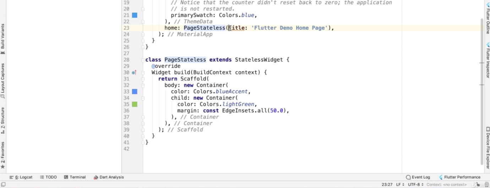
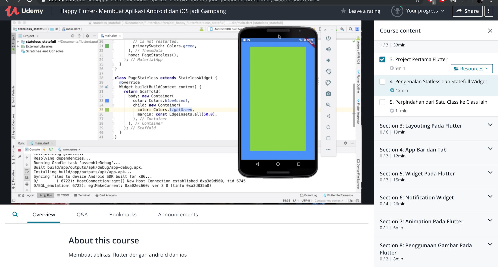
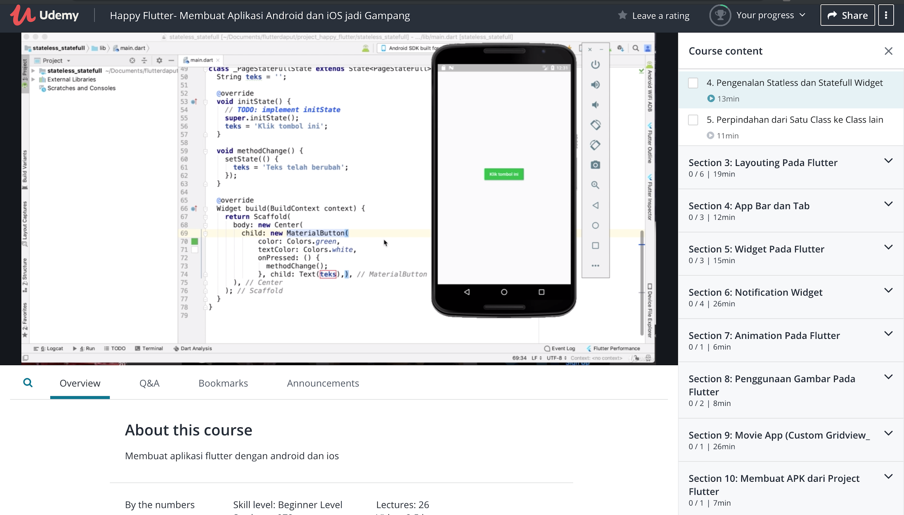

Jika Anda bekerja sebagai developer aplikasi mobile baik itu Android maupun iOS, ada beberapa bahasa pemrograman umum yang harus dikuasai seperti Java Android, Swift untuk mengembangkan aplikasi iOS, Kotlin, dan sebagainya.

Mengembangkan aplikasi di Android dan iOS membutuhkan wawasan bahasa pemrograman yang berbeda, sehingga kebanyakan dari developer lebih menguasai satu bahasa tertentu dan membutuhkan bantuan untuk developer lain untuk mengembangkan di platform lain.

Namun di tahun 2017, ada kabar baik bagi seluruh developer aplikasi mobile.

Kabar ini dibawakan oleh Google yang merilis SDK (Software Development Kit) yang memungkinkan pengembangan aplikasi lintas platform hanya dengan satu bahasa pemrograman.

SDK tersebut adalah Flutter, yang menjadi topik pembahasan kita kali ini. 

Untuk belajar flutter, kita diharuskan memahami bahasa pemrograman yang juga dikembangkan oleh Google yaitu Dart. 

Dart merupakan bahasa pemrograman yang ditujukan untuk penggunaan umum, sehingga dalam perkembangannya bahasa ini diharapkan dapat menjadi lebih mudah dipahami, efisien, serta dapat digunakan lintas platform bagi developer.

## Table Of Contents

## Belajar Flutter untuk Pemula

Bagi kamu yang ingin belajar flutter, terdapat beberapa unsur-unsur dasar yang harus dipahami terlebih dahulu sebelum memulai menulis barisan kode.

Setiap elemen tatap muka yang terdapat di flutter disebut dengan istilah widget. Terdapat dua jenis widget, yakni sebagai berikut:

**Stateless widget**

Berdasarkan penjelasan Udacoding dalam video kursus di Udemy yang bertajuk “[Happy Flutter - Membuat Aplikasi Android dan iOS Jadi Gampang](https://www.udemy.com/course/happy-flutter-membuat-aplikasi-android-dan-ios-jadi-gampang/?deal_code=&utm_campaign=a5a38000000zp5bAAA_._ContentCollisionAUG19&utm_content=Editorial&utm_medium=udemyads&utm_source=aff-campaign&utm_term=Content)”, stateless widget adalah elemen yang dibuat hanya dengan konfigurasi yang telah ditentukan dari awal. 

Dapat disimpulkan, widget ini tidak akan berubah dan bersifat statis. Sebagai contoh, jika kita ingin membuat halaman berisi kontainer dengan warna latar yang tidak akan berubah.

Setelah dijalankan pada emulator, aplikasi akan tampak seperti berikut ini:

Widget ini tidak akan berubah meskipun Anda menekan layar. Jadi, elemen-elemen yang sifatnya statis dibuat dengan Stateless widget. 

Widget ini juga hanya dapat digunakan satu kali dan tidak dapat digunakan ulang di layar lain sehingga jika Anda ingin menggunakan kembali widget stateless yang sudah dibuat, maka Anda harus membuat kembali dari awal (mengkoding kembali).

**Stateful widget**

Berlawan dengan stateless widget, stateful widget bersifat dinamis dan dapat berubah-ubah sesuai dengan perintah yang diberikan. Stateful widget juga dapat berubah bentuk lebih dari satu kali dan dapat digunakan pada layar lain ketika aplikasi dijalankan.

Sebagai contoh, ketika kita menekan sebuah tombol, maka bentuk tombol tersebut akan berubah atau teks pada tombol tersebut berubah.

**Layout Flutter**

Layout merupakan hal terpenting ketika kita mengembangkan sebuah aplikasi karena kenyamanan dan kemudahan penggunaan sangat ditentukan oleh layout. 

Tampilan layout pada flutter terdiri dari sebuah hierarki widget dimana terdapat widget tidak tampak yang mengatur tata letak dan widget yang tampak pada tatap muka pengguna seperti tombol like, gambar, text box, dan lain-lain. 

Anda dapat melihat list widget selengkapnya di situs resmi flutter.

## Memperdalam Belajar Flutter di Udemy

Meskipun tergolong baru, Flutter dan bahasa pemrograman Dart memiliki masa depan yang cerah dalam dunia pengembangan aplikasi mobile sehingga Anda patut mempertimbangkan mempelajari metode pembuatan aplikasi menggunakan tools ini. 

Saya merekomendasikan untuk mengambil kursus Flutter di [Udemy](https://www.udemy.com/?deal_code=&utm_source=aff-campaign&utm_medium=udemyads&utm_term=Content&utm_content=Editorial&utm_campaign=a5a38000000zp31AAA_._ContentCollisionAUG19) yang diajarkan oleh Udacoding di Udemy.bagi Anda yang ingin belajar flutter dan mendalaminya.

Materi yang disampaikan dalam Bahasa Indonesia akan mempermudah Anda untuk memahami materi yang disampaikan. Selain itu, mentor telah menyiapkan resources yang Anda butuhkan selama proses pembelajaran dimana resources tersebut dapat diunduh ke komputer Anda. 

Bagi Anda yang belum memiliki kartu kredit atau ATM, dapat membeli kursus di Udemy dengan pembayaran melalui Indomaret dan Alfamart.

Tersedia pula berbagai kelas selain flutter seperti [web development](https://www.udemy.com/course/become-a-wordpress-developer-php-javascript/?deal_code=&utm_source=aff-campaign&utm_medium=udemyads&utm_term=Content&utm_content=Editorial&utm_campaign=a5a38000000zp5HAAQ_._ContentCollisionAUG19), desain grafis, keamanan siber, dan lain-lain di Udemy. Silakan berkunjung ke websitenya untuk melihat selengkapnya. 

Sekian artikel kali ini. Sampai jumpa di artikel berikutnya.