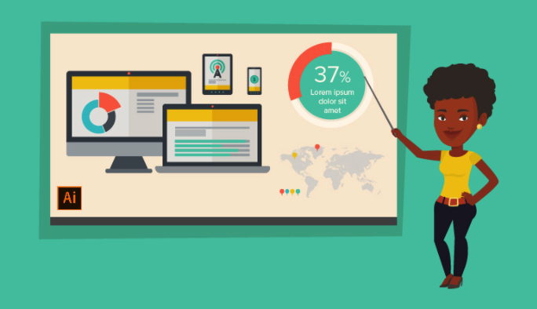

Taukah anda bahwa menampilkan sebuah informasi melalui bentuk visual dapat meningkatkan daya tarik audiens? Karena faktanya, secara biologis otak manusia akan lebih menyukai dan lebih mudah menerima informasi dalam bentuk visual. 

Salah satu tampilan visual yang dapat dijadikan sebagai medium menyampaikan sebuah informasi atau pesan tertentu ialah infografis. Dalam artikel ini kita akan membahas mengenai bagaimana cara membuat infografis yang dapat memikat audiens.

Namun sebelum membahas lebih lanjut, ada baiknya kita memahami infografis terlebih dahulu.

## Table Of Contents

## Apa itu Infografis dan Contohnya?

Infografis merupakan kepanjangan dari informasi dan grafis.

Infografis sendiri dapat dimengerti sebagai sebuah informasi yang tampil dalam bentuk teks yang dikombinasikan dengan komponen visual yakni, gambar, ilustrasi, grafik, atau tipografi.

Karena ruang untuk menampilkan teks dalam sebuah infografis sangatlah terbatas, maka teks itu harus berisi pesan atau informasi utama yang disaring dari sebuah narasi utuh berdasarkan pada topik tertentu. 

Narasi ini bisa dalam bentuk tulisan, video, maupun audio. Dengan kata lain, teks dalam sebuah infografis tidak tampil dalam bentuk yang utuh. 

**Mengapa demikian?**

Sebab, infografis memiliki fungsi untuk memudahkan para audiens atau pembaca dalam memahami kandungan dari informasi tertentu. Di samping itu, infografis juga dapat berfungsi sebagai medium untuk menarik minat seseorang terhadap informasi yang disampaikan.

Dewasa ini, infografis memiliki berbagai macam kegunaan. Kegunaan tersebut dimulai dari memudahkan pemaparan/presentasi sebuah informasi atau hasil penelitian, sebagai medium untuk mengkampanyekan suatu persoalan atau topik tertentu, hingga dijadikan sebagai medium periklanan produk/brand/perusahaan. 

Seperti yang telah disinggung di atas, infografis tidak semata-mata menampilkan teks yang ringkas semata. Namun, teks tersebut harus berisi mengenai poin-poin pokok dari sebuah informasi tertentu. Sebab, sebuah teks yang singkat tidak serta merta mencerminkan poin utama atau pokok dari sebuah narasi. Bahkan, justru dapat membuat informasi tersebut menjadi melenceng. 

Karena itulah, dalam membuat sebuah infografis sangat diperlukan untuk melakukan riset yang mendalam. Anda dapat memulai riset tersebut dengan bertolak dari beberapa pertanyaan. 

Pertanyaan itu dapat dibagi ke dalam tiga kategori, yakni pertanyaan utama, pertanyaan pendukung, pertanyaan eksploratif. Anda dapat melakukan riset dengan melalui beragam sumber, dari mulai buku, jurnal, wawancara, berita, artikel, dll. 

Di samping itu, guna menunjang pesan tersampaikan, Anda dapat membingkainya dengan gambar, ikon, font, desain template, serta memadukannya dengan beberapa warna yang dirasa selaras. Hal tersebut bermanfaat guna memicu daya tarik audiens untuk masuk atau membaca informasi utama yang Anda miliki. 

Namun, bila Anda merasa kurang memiliki kemampuan yang mumpuni dalam melakukan desain grafis, Anda dapat mencoba beberapa platform desain grafis yang tersedia secara online. Di bawah ini akan disebutkan beberapa platform yang dapat memudahkan cara membuat infografis.  

*(Baca juga : Hosting <a href="http://www.domainesia.com/hosting/">Murah</a> Gratis)*

## Platform untuk Membuat Infografis Online

Setelah membaca ulasan di atas, mungkin anda merasa bahwa membuat infografis begitu sulit. Atau, anda menganggap bahwa hanyalan orang-orang yang jago desain grafis saja yang dapat membuat sebuah infografis. 

Namun anggapan tersebut sebaiknya segera anda kubur, karena terdapat beberapa platform yang akan membuat keinginan anda terwujud. Saya akan menyebutkan tiga platform online yang rekomended untuk anda gunakan. Yang perlu Anda lakukan hanyalah mengakses situs-situs tersebut di mesin pencarian.

### Membuat Infografis dengan Visme

Visme ialah sebuah platform desain grafis yang menawarkan beraneka ragam fitur-fitur menarik. Platform ini dikembangkan untuk memenuhi kebutuhan marketing. Fitur-fitur yang disediakan di antaranya ialah beragam font, gambar, grafik, dan ikon.

Platform ini juga tersedia secara gratis dan memungkinkan Anda untuk dapat membuat 5 project dan menyediakan akses penyimpanan sebesar 100MB. Namun tentu saja, dengan mode gratis ini beberapa fitur yang dapat Anda gunakan juga terbatas. 
Cara mengoperasikan platform ini juga relatif sederhana. Platform ini juga menyediakan video instruksional yang dapat memandu Anda membuat project kreatif meski belum mendalami kemampuan desain grafis. 

### Membuat Infografis dengan Canva

Canva merupakan platform online yang cukup populer dalam dunia desain grafis. Canva dapat diakses secara gratis dan menyediakan beragam fitur yang dapat membuat hasil project Anda tampil dengan elegan. 

Beberapa fitur yang disediakan antara lain ialha ikon, bentuk grafis, gambar yang masing-masing tersedia dengan beragam opsi. Canva menyediakan dua metode dalam membuat desain, yakni dengan mengkustomisasi template yang terlah tersedia dan dengan melakukan kustomisasi dari tahap awal. 

Canva juga tersedia untuk membuat ragam jenis desain dari mulai kartu ulang tahun, post Instagram, poster, banner, dan infografis. 

### Membuat Infografis dengan Venngage

Platform ini hampir serupa dengan platform di atas. Dengan menawarkan beragam fitur yang dapat membuat project Anda menjadi tampil dengan menarik, Venngage juga dapat digunakan bagi Anda yang belum menguasai kemampuan desain grafis. 

Namun fitur-fitur yang diberikan tidak semua dapat diakses secara gratis. Anda perlu merogoh kocek $19 per bulan untuk dapat menggunakan semua fitur yang disediakan. Akan tetapi Venngage tetap menyediakan akses gratis bagi para pelajar. 

Biaya yang Anda keluarkan untuk dapat mengakses platfotm ini, kiranya juga sebanding dengan hasll project yang akan Anda peroleh. Beberapa keuntungan ketika menggunakan Venngage ialah tersedianya beragam jenis fitur template dari mulai perbandingan, timeline, geografis, charts, tutorial, serta konsep statistik. 

Platform ini juga menyediakan beragam komponen-komponen pendukung yang dapat membuat hasil desain Anda semakin sempurna. Di antarnya ialah simbol, diagram, ikon, serta peta yang disesuakan dengan infromasi yang Anda publikasikan. 

## Menarik Kesimpulan

Itulah beberapa ulasan mengenai cara membuat infografis. Bila Anda merasa belum memiliki kemampuan handal dalam desain, Anda dapat menggunakan beberapa platform online yang dapat memberikan beragam kemudahan dan mampu memberikan hasil yang menawan. Semoga informasi ini dapat memberikan manfaat. 
